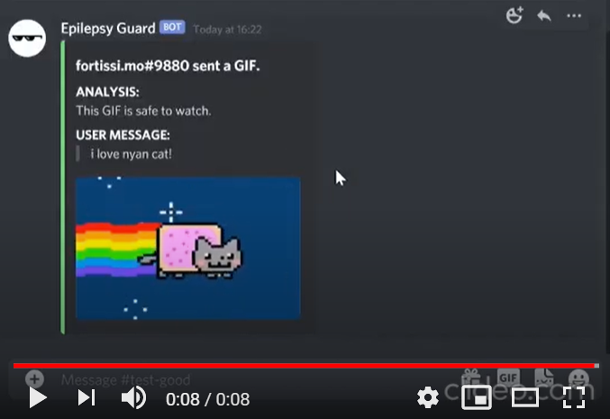
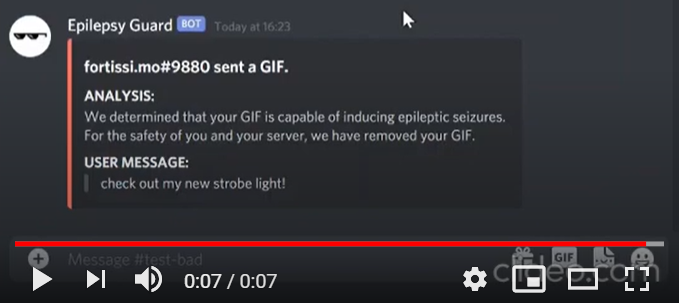

# epilepsy-guard

A Discord bot that protects epileptic users by screening GIFs for rapid flickers, flashes, or blinks.

🎈 This document does NOT contain any GIFs that could harm photosensitive or epileptic readers. The testing server and the attached YouTube videos are safe as well.

## Dependencies
- Python 3.5.3 or greater.
- `python -m pip install discord.py`
- `python -m pip install Pillow`
- `python -m pip install requests`

## Installation Instructions
1. Clone this repo (`git clone https://github.com/devinkwmo/epilepsy-guard.git`)
2. Create a virtual environment, and activate it.
3. Install all [dependencies](#dependencies).
4. Enter your bot's `CLIENT_SECRET` in a file called `secret.py`.
5. Run ``python3 epilepsy_guard.py``.

## Server Invitation
- To join the Epilepsy Guard Testing Server, [click me](https://discord.gg/wctpppv2EJ).
- To invite the bot to a server you moderate, [click me](https://bit.ly/2X7gj26).
